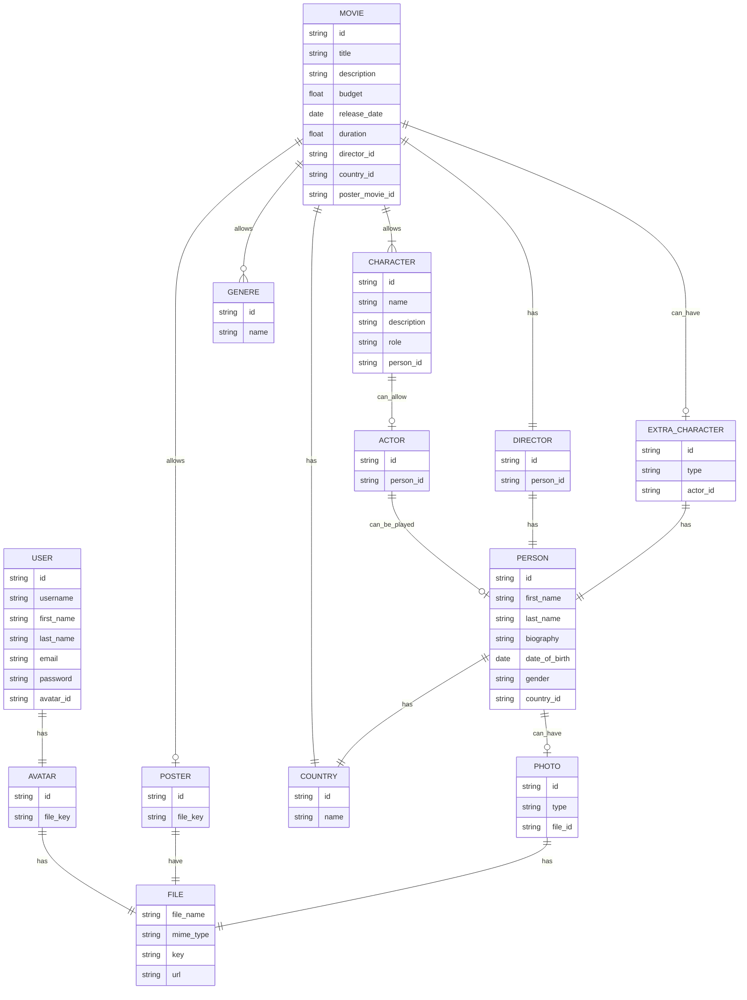

# movie-app-db-sql

## ER Diagram

```mermaid
erDiagram
    USER {
        string id
        string username
        string first_name
        string last_name
        string email
        string password
        string avatar_id
    }
    AVATAR {
        string id
        string file_key
    }
    USER ||--|| AVATAR: has
    AVATAR ||--|| FILE: has

    FILE {
        string file_name
        string mime_type
        string key
        string url
    }
    MOVIE {
        string id
        string title
        string description
        float budget
        date release_date
        float duration
        string director_id
        string country_id
        string poster_movie_id
    }
    MOVIE ||--|{ CHARACTER: allows
    ACTOR {
        string id
        string person_id
    }
    CHARACTER ||--o| ACTOR: can_allow
    ACTOR ||--o| PERSON: can_be_played
    CHARACTER {
        string id
        string name
        string description
        string role
        string person_id
    }
    MOVIE ||-- o{ GENERE: allows
    GENERE {
        string id
        string name
    }
    MOVIE ||--o| POSTER: allows
    POSTER {
        string id
        string file_key
    }
    POSTER ||--|| FILE: have
    MOVIE ||--|| COUNTRY: has
    COUNTRY {
        string id
        string name
    }
    MOVIE ||--|| DIRECTOR: has

    DIRECTOR {
        string id
        string person_id
    }
    DIRECTOR ||--|| PERSON: has
    PERSON {
        string id
        string first_name
        string last_name
        string biography
        date date_of_birth
        string gender
        string country_id
    }
    PERSON ||--|| COUNTRY:has
    PHOTO {
        string id
        string type
        string file_id
    }
    PERSON ||--o| PHOTO: can_have
    PHOTO ||--|| FILE: has

EXTRA_CHARACTER {
    string id
    string type
    string actor_id
}

MOVIE ||--o| EXTRA_CHARACTER: can_have
EXTRA_CHARACTER ||--|| PERSON: has
```
